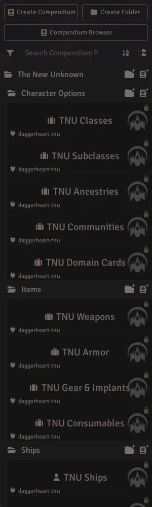
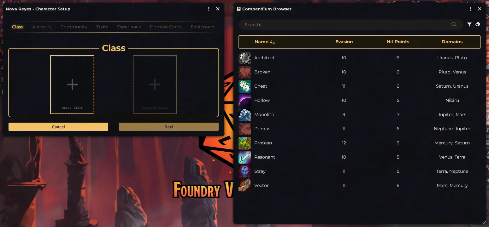
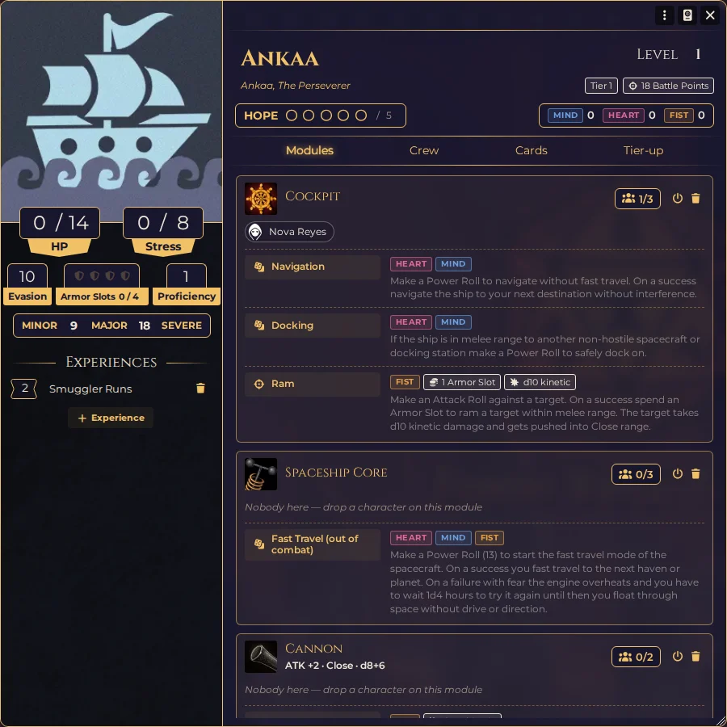
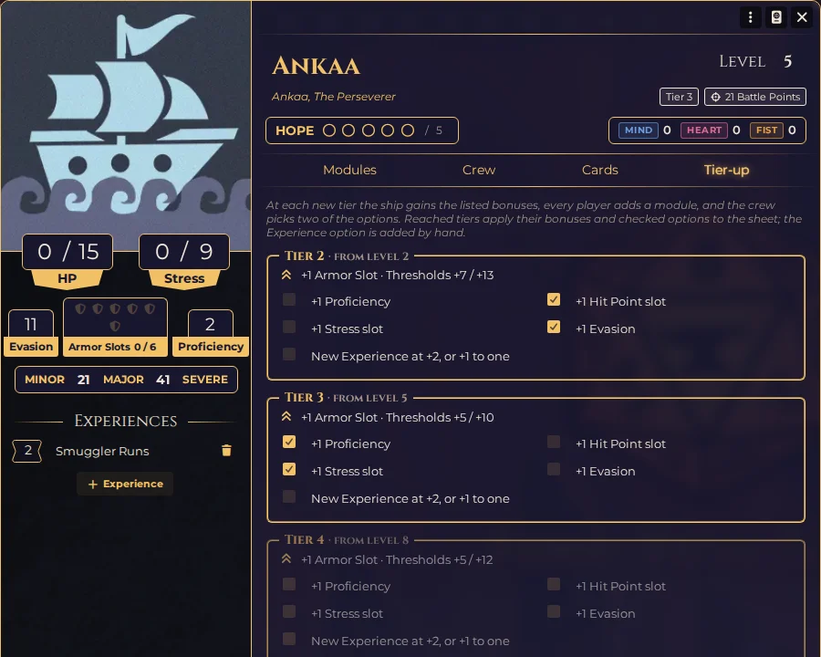
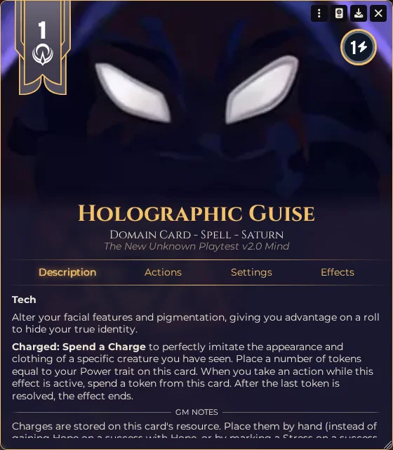
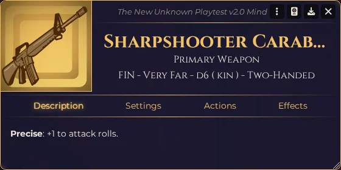
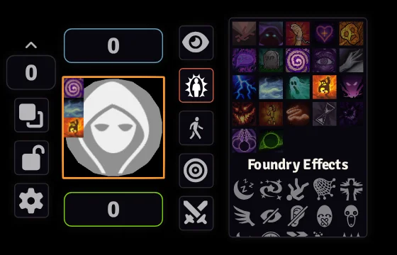

# The New Unknown (Daggerheart)

> [!WARNING]
> **Alpha module.** It stays in alpha until the final version of The New Unknown
> is released. Expect sudden, breaking changes and **data loss** between
> versions: back up your world before updating.

A Foundry VTT **module** that adapts the *Daggerheart* system for the sci-fi
fan supplement **The New Unknown (TNU)** — Playtests 1 "Heart", 2 "Mind" and 3 "Fist".

It does **not** replace Daggerheart. It sits on top of it and adds the TNU
content: classes, ancestries, communities, domains, equipment, adversaries,
ships, new conditions and the TNU terminology.

**The New Unknown** is made by its own authors, not by this module. To get the
game itself and support it:

- [The New Unknown on Kickstarter](https://www.kickstarter.com/projects/1981524065/the-new-unknown-a-sci-fi-role-playing-game)
- [The New Unknown playtest on Heart of Daggers](https://heartofdaggers.com/products/the-new-unknown-2nd-preview-playtest-volume-2-0-mind/)


[](https://buymeacoffee.com/mestredigital) [](https://mestredigital.online/pages/projetos-en)

---

## Requirements

- **Foundry VTT v14**
- The **Daggerheart** game system, version **2.10.9** exactly. The module relies
  on internal structures of the system, so it is locked to the version it was
  built and tested against.

## Installation

In Foundry, go to **Add-on Modules → Install Module** and paste this manifest URL:

```
https://github.com/brunocalado/daggerheart-tnu/releases/latest/download/module.json
```

Then open your Daggerheart world, go to **Settings → Manage Modules**, enable
**The New Unknown (Daggerheart)** and reload when prompted.

---

## What this module adds

### 📚 Compendiums
Everything lives under **The New Unknown** in the Compendium tab, laid out like
the system's own packs:

- **Character Options** — 10 classes (Architect, Broken, Cheat, Hollow,
  Monolith, Primus, Protean, Resonant, Stray, Vector) with their subclasses,
  ancestries, communities and domain cards.
- **Items** — weapons, armor, consumables, and gear & implants.
- **Ships** — the Ankaa and Taurus ships, plus ship modules and ship domain cards.
- **Adversaries**, the **TNU Gear** and **TNU Expendables** rarity tables, and
  **journals** with the TNU rules, the ship rules, the classes & domains
  overview and the campaign frames (INSOMNIUM, STARHOPPING, X//666: HELLRAVE).



### 🧑‍🚀 Character creation with TNU content only
The first time the GM loads the world with the module enabled, the Daggerheart
SRD is hidden from the system's Compendium Browser — which is what the
character creator uses to pick ancestries, communities, classes, subclasses,
domain cards and equipment. Players only see TNU (and your world's) content.

To bring the SRD back, open the Compendium Browser as GM, click **Browser
Settings** and re-enable the **Daggerheart** source. The module won't hide it
again.



### 🚀 Ships
A **Ship** actor type with its own sheet, played jointly by the crew:

- Hit Points, Stress, Hope and Armor Slots tracks, Evasion, Proficiency and
  damage thresholds — adversaries attack and damage a ship like any other target.
- **Modules** and **ship domain cards**: crew members are placed in modules and
  use their features with their own Power Trait, paying costs from the ship's
  resources.
- **Spaceship Experiences** that spend ship Hope.
- **Tier-up applied automatically:** raising the level to 2, 5 or 8 adds that
  tier's Armor Slot and threshold raises, and each option the crew checks (two
  per tier) adds its bonus to the sheet.
- Stress overflow and "beyond repair" prompts for the GM.

See the **Ships** journal for the rules and how the sheet runs them.





### 🪐 Ten new domains
The domain dropdown on **Domain Card** items lists the TNU planetary domains:

> **Mind:** Mercury · Saturn · Uranus  
> **Heart:** Pluto · Venus · Terra  
> **Fist:** Neptune · Jupiter · Mars  
> **Outside the spheres:** Nibiru



### ⚔️ Weapon & armor keywords
All TNU weapon and armor **features** (keywords) are added to the feature picker
on weapon and armor items — 32 weapon keywords (Precise, Rupture, Lethal,
Tether, Shockwave, …) and 10 armor keywords (Adaptive, Phantom, Regrowth,
Deflect, …). They show the keyword and its rules text; apply the effect at the
table.



### 🩸 New conditions (token status icons)
The TNU conditions appear in the token status menu:

> Dazed · Distracted · Weakened · Stunned · Shrouded · Tormented · Ignited ·
> Panicked · Frenzied · Ordered · Infested · Slowed · Terrified · Confused ·
> Saturated

- **Dazed** — attack rolls get **-2** automatically.
- **Distracted** — **Evasion drops by 2** automatically. On an adversary, lower
  its Difficulty by 2 yourself.
- **Weakened** and **Confused** add a disadvantage reminder to the roll dialog.
- The rest are **markers**: apply their effect at the table.



> *Vulnerable, Hidden, and Restrained already come with Daggerheart, so they are
> not duplicated here.*

### 📝 Renamed terminology
Only the **labels** change; the mechanics are identical:

| Daggerheart term | Shown as |
|---|---|
| Scars | **Trauma** |
| Spellcast / Spellcasting Trait | **Power Trait** |
| Spellcast Roll | **Power Roll** |
| Physical damage (Phy) | **Kinetic (kin)** — including resistances and armor rules |
| Magical damage (Mag) | **Energy (ene)** — including resistances and armor rules |

### 💳 Sci-fi currency
The currency is renamed to **Credits**. The Handfuls, Bags and Chests tiers stay
on — TNU prices a new ship at "a chest full of credits". Change it back any time
under **Settings → Daggerheart → Homebrew**.

---

## Good to know

- **What the module writes to your world.** Domains, keywords, conditions and
  labels are added in memory each time the world loads, and disappear when the
  module is disabled. Two settings are written once by the GM: the currency
  rename and the hidden SRD in the Compendium Browser. Both can be undone in
  the system's own settings.
- **Icons are placeholders.** Domains reuse Daggerheart's domain art and
  conditions use icons from Foundry's built-in library.
- **Not automated:** Charges, Echo and the other advanced TNU systems are
  described in the TNU Rules journal and run at the table.

---

## License

- **Code:** [GPL v3](https://www.gnu.org/licenses/gpl-3.0.html).
- **The New Unknown content:** belongs to its authors, under the
  [DPCGL](https://darringtonpress.com/license/).
- **Compendium banner:** [Forward field](https://game-icons.net/1x1/lorc/forward-field.html)
  by Lorc, [CC BY 3.0](https://creativecommons.org/licenses/by/3.0/).

---

## Permission

This module is published with the explicit permission of Alexander
([Eurydice: Echoes of Ink on Patreon](https://www.patreon.com/c/Eurydice_echoes_of_ink/home)).
